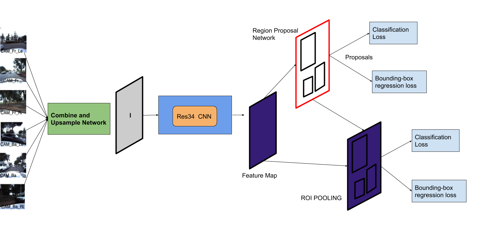

# Deep Learning self-drive-object-detection

For object detection task, ResNet-34 backbone based FasterRCNN was trained with input from CombineAndUpSamplenetwork. CombineAndUpSample network and ResNet-34used for this task both initialized their weights from the net-work weights obtained from PIRL based pre-text training.

## Combine and Upsample Module


## Object detection F-RCNN pipe



## Description for python files

`data_helper.py` - Utility for Data parsing and loading for bounding box prediction.<br>
`helper.py` - Helper for data-helper.py<br>
`engine.py` - Train and eval routines for training Faster-RCNN.<br>
`main_object_detection_frcnn.py` - Main initialisation code for training Faster RCNN for object detection.<br>
`models.py` - Combine and upsample and general models py file.<br>
`network_helpers.py` - utility to copy the weights.<br>
`utils.py` - Utility for logging purposes.<br>


### Command to execute object detection
```python main_object_detection_frcnn.py  --input-data-images-file ../../proj-DL/student_data/data/ --input-data-annotation-file ../../proj-DL/student_data/data/annotation.csv  --backbone-pretrained-weights-file e1_simclr_auto_main_epoch_120 --save-final-model-path ../```

Args:<br>
`--backbone-pretrained-weights-file` Model file path for weights pretrained with PIRL<br>
`--save-final-model-path` File path to save the final Model<br>

### Code for PIRL SSL and road map Segmentation can be found [here. ](https://github.com/aniket03/auto_drive_ssl)
