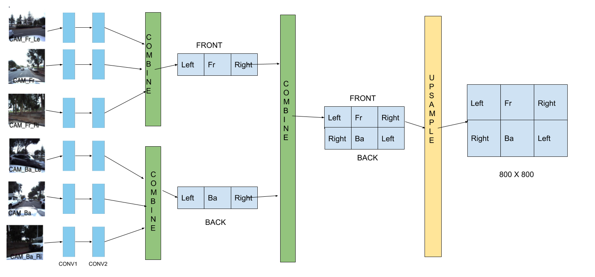

# auto-drive-object-detection

For object detection task, ResNet-34 backbone based FasterRCNN was trained with input from CombineAndUpSamplenetwork. CombineAndUpSample network and ResNet-34used for this task both initialized their weights from the net-work weights obtained from PIRL based pre-text training.




`data_helper.py` - Utility for Data parsing and loading for bounding box prediction.
`helper.py` - Helper for data-helper.py
`engine.py` - Train and eval routines for training Faster-RCNN.
`main_object_detection_frcnn.py` - Main initialisation code for training Faster RCNN for object detection.
`models.py` - Combine and upsample and general models py file.
`network_helpers.py` - utility to copy the weights.
`utils.py` - Utility for logging purposes.


```python main_object_detection_frcnn.py  --input-data-images-file ../../proj-DL/student_data/data/ --input-data-annotation-file ../../proj-DL/student_data/data/annotation.csv  --backbone-pretrained-weights-file e1_simclr_auto_main_epoch_120 --save-final-model-path ../```

Args:
`--backbone-pretrained-weights-file` Model file path for weights pretrained with PIRL
`--save-final-model-path` File path to save the final Model

